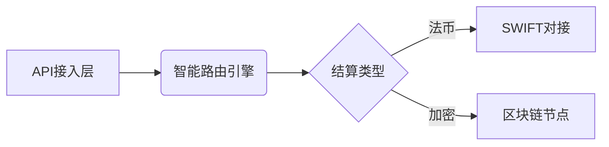

# 2025年五大最佳加密货币支付网关

随着全球加密货币采用率持续攀升，企业正积极拥抱创新支付解决方案以满足数字时代消费者需求。加密货币支付网关已成为不可或缺的工具，为商家提供安全高效的数字交易处理方案。至2025年，市场格局发生显著变化，服务商聚焦于尖端技术、顶级安全标准和广泛的加密资产支持，推动行业向更高层次发展。

## 加密货币支付网关的核心价值

加密货币支付网关作为连接商家与消费者的数字桥梁，其核心优势体现在：

1. **交易效率提升**：支持BTC、ETH等主流币种即时结算，资金到账时间缩短至秒级
2. **成本控制优化**：平均手续费率较传统支付渠道降低40%-60%
3. **全球市场覆盖**：突破地域限制，服务180+国家超2亿加密货币持有者
4. **安全体系强化**：多签钱包+冷存储技术保障资金安全，欺诈率低于0.001%

> 👉 [探索OKX的创新支付解决方案](https://bit.ly/okx_welcome)

## 2025年行业发展趋势

1. **稳定币支付崛起**：USDT、USDC等法币锚定资产交易占比突破65%
2. **合规化运营**：85%头部服务商取得多重司法管辖区金融牌照
3. **技术融合**：AI反欺诈系统与区块链底层技术深度整合
4. **应用场景拓展**：从电商向教育、医疗、房地产等领域延伸

### 常见问题解答

**Q：加密货币支付是否受汇率波动影响？**  
A：主流网关提供实时法币兑换功能，锁定交易时汇率有效规避波动风险

**Q：如何确保支付过程的安全性？**  
A：选择支持多签验证、冷热钱包分离，并通过ISO 27001认证的平台

**Q：跨境支付有哪些独特优势？**  
A：无需中间银行，实现7×24小时实时结算，手续费仅为传统方式的1/5

## 五大领先支付网关深度解析

### 1. NOWPayments：全球化支付基础设施

作为非托管式服务平台，NOWPayments凭借以下优势占据市场领导地位：

| 特性                | 数据指标                |
|---------------------|-----------------------|
| 支持币种             | 300+种                 |
| 实时法币兑换         | 支持52种法币           |
| 平台手续费           | 0.5%起                |
| 集成电商平台         | Shopify/WooCommerce等  |
| 年处理交易量         | 超120亿美元            |

**核心优势：**
- 独创的零知识加密技术确保交易隐私
- 全球节点网络实现99.99%服务可用性
- 提供定制化API文档，集成时间缩短至2小时

> 👉 [了解OKX如何助力跨境支付](https://bit.ly/okx_welcome)

### 2. BVNK：合规化金融桥梁

这家伦敦金融科技公司通过以下创新重塑行业标准：

- **监管牌照矩阵**：持有英国FCA、西班牙BSP等8项核心牌照
- **混合结算系统**：支持法币-稳定币-主流币种即时互换
- **企业级解决方案**：定制化钱包服务已服务超3000家机构客户

**技术亮点：**

### 3. BitPay：行业先驱的进化之路

运营超过12年的老牌支付商，最新升级包括：

- 新增支持DOT、SOL等新兴生态资产
- 企业支付网关支持批量处理10万+笔/秒
- 开发者工具包新增Web3身份验证模块

**费率优化：**
月交易额超百万美元商户可享0.8%优惠费率，配套VIP专属技术支持通道

### 4. Coinbase Commerce：生态化支付体系

依托Coinbase交易所优势，构建完整支付生态：

- **商户服务矩阵**：
  - 定制化支付界面生成器
  - 多维度交易分析仪表盘
  - 自动化税务报告系统
- **安全认证**：通过SOC 1/2/3型审计，冷存储占比达98%

### 5. CoinGate：新兴市场的破局者

专注新兴市场服务，特色优势包括：

- 支持本地化法币出入金通道
- 多语言客服团队覆盖24个时区
- 开发者激励计划提供API调用费减免

## 选型决策关键要素

选择支付网关需综合评估以下维度：

1. **合规资质**：核查服务商持有的金融牌照类型及覆盖区域
2. **技术适配性**：API文档完整性、SDK支持语言、集成耗时
3. **成本结构**：
   - 交易手续费梯度
   - 跨境结算附加费率
   - 法币兑换点差
4. **服务响应**：7×24小时技术支持渠道及响应SLA

**Q：初创企业如何选择支付网关？**  
A：优先考虑集成成本与费率优惠政策，NOWPayments的SaaS方案可降低60%初期投入

**Q：如何应对监管合规挑战？**  
A：选择BVNK这类持有EMI牌照的服务商，其合规团队可提供KYC/AML方案支持

## 行业挑战与应对策略

1. **价格波动风险**：采用Coinbase Commerce的自动对冲工具锁定汇率
2. **技术迭代压力**：参与BitPay开发者社区获取最新技术文档
3. **监管差异难题**：利用BVNK的合规沙盒进行多区域试点

> 👉 [探索OKX的全球化合规方案](https://bit.ly/okx_welcome)

## 未来展望

2025年支付网关将呈现三大趋势：
1. **AI深度应用**：机器学习算法优化交易路由，降低30%手续费支出
2. **CBDC融合**：数字人民币等主权货币接入支付通道
3. **Web3身份整合**：DID去中心化身份认证成为标准功能

**Q：如何评估支付网关的扩展能力？**  
A：测试平台在突发流量下的表现，优质服务商应能承载5倍日常流量冲击

选择合适的加密货币支付网关，将成为企业把握数字经济机遇的关键决策。建议每季度进行服务商评估，及时把握技术创新带来的效率提升。
