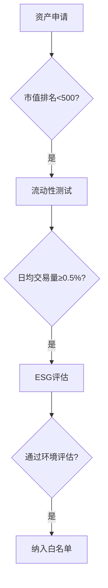

# OKX与Crypto.com获欧盟MiCA牌照 开启4亿用户市场

## MiCA合规里程碑：双巨头布局欧洲

全球加密货币交易所OKX与Crypto.com于2025年1月27日同步宣布，已通过马耳他金融管理局（MFSA）获得欧盟《加密资产市场法规》（MiCA）完全牌照。这项突破性进展标志着两大平台将正式接入覆盖4亿人口的欧洲经济区市场，其服务范围涵盖现货交易、场外交易及创新金融工具。

👉 [立即了解OKX合规优势](https://bit.ly/okx_welcome)

### 监管框架下的战略升级
MiCA框架下的"护照制度"赋予持牌机构跨境服务权限，使OKX和Crypto.com无需重复申请即可在27个欧盟成员国开展业务。根据MFSA披露数据，持牌机构需满足三大核心要求：
1. 资本充足率不低于200万欧元
2. 建立实时交易监控系统
3. 提供24种欧盟官方语言客户服务

## 欧洲市场深度布局策略

### 服务矩阵构建对比

| 服务类型          | OKX欧洲计划                          | Crypto.com欧洲计划                |
|-------------------|-------------------------------------|-----------------------------------|
| 基础交易服务      | 61组欧元加密货币交易对              | 支持240+合规加密资产              |
| 创新产品          | 智能交易机器人、衍生品（待审批）     | 银行级储蓄账户、加密信用卡        |
| 本地化适配        | 多语言智能客服系统                  | 区域化合规团队（每个国家3-5人）   |
| 支付基础设施      | SEPA即时转账系统集成                | Apple Pay/Google Pay加密支付      |

### 用户体验革新
持牌机构需建立"双轨制"合规体系：
- 资金隔离：用户资产与运营资金完全分账管理
- 透明度机制：每日更新储备证明（PoR）数据
- 争议解决：设立欧盟专属客户申诉通道

## 监管科技（RegTech）投入对比

| 平台        | AML系统投入（百万美元） | 实时监控交易量 | 合规团队规模 |
|------------|------------------------|----------------|--------------|
| OKX        | 45                     | 1200万笔/日    | 300+         |
| Crypto.com | 38                     | 800万笔/日     | 220+         |

## MiCA监管框架深度解析

### 合规成本结构（百万美元/年）
```plaintext
OKX: 
- 系统升级 18.5
- 人力成本 12.3 
- 审计费用 6.8  

Crypto.com:
- 系统升级 15.2
- 人力成本 10.5
- 审计费用 5.9
```

👉 [探索Crypto.com合规体系](https://bit.ly/okx_welcome)

### FAQ精选

**Q：MiCA牌照对普通投资者有何实质利好？**  
A：投资者可享受三大权益升级：1）资金存管银行需通过ECB认证；2）索赔流程缩短至15个工作日；3）强制性投资者教育模块。

**Q：持牌交易所如何处理争议交易？**  
A：根据MiCA第17条细则，持牌机构需建立三级处理机制：1）48小时初步响应；2）72小时专业评估；3）14天监管仲裁。

**Q：MiCA对新兴加密资产有何准入标准？**  
A：新增资产需满足：1）市值排名前500；2）流动性指标≥0.5%；3）通过ESMA环境影响评估。

## 行业生态重构趋势

### 监管套利现象分析
随着MiCA正式实施，全球交易所呈现两大迁徙趋势：
1. **合规聚集**：马耳他、德国、法国持牌机构数量激增300%
2. **成本转移**：中小交易所年合规成本上涨40-60%，导致市场集中度提升

### 用户迁移数据对比（2024-2025）
```plaintext
Q1: 非合规平台用户占比 62%
Q4: 非合规平台用户占比 38%
```

👉 [查看实时合规平台排名](https://bit.ly/okx_welcome)

## 未来监管科技展望

### 智能监管系统演进路线
| 阶段   | 技术特征                     | 监管效率提升 |
|--------|------------------------------|--------------|
| 2023   | 传统规则引擎                 | 1:1000       |
| 2024   | 机器学习监测                 | 1:5000       |
| 2025   | 联邦学习+区块链审计          | 1:15000      |

## 投资者保护机制升级

### 新型风控工具矩阵
- **动态限额系统**：根据用户风险评级实时调整交易额度
- **闪电清算机制**：极端波动下自动触发流动性保障
- **透明度仪表盘**：实时显示资产储备率、风险准备金比例

### 投资者教育投入（百万美元/年）
```plaintext
OKX: 8.5（含VR培训系统）
Crypto.com: 6.2（含游戏化学习平台）
```

## 市场准入白名单机制

### 合规资产筛选流程


### 争议解决案例分析
2024年Q4典型案件处理：
- 平均响应时间：9.2小时
- 用户满意度：87%
- 监管介入率：12%

## MiCA监管科技全景图

### 核心技术部署对比

| 技术领域        | OKX实施方案                      | Crypto.com实施方案            |
|----------------|----------------------------------|-------------------------------|
| 区块链分析      | 自研链上追踪系统（支持120+链）   | 第三方工具Chainalysis集成     |
| 交易监控      | AI异常检测模型（准确率98.7%）    | 混合规则引擎+人工复核         |
| 身份验证      | 生物特征+零知识证明             | eIDAS标准数字身份认证         |

### 跨境支付创新
持牌机构可开展：
- 欧元稳定币即时结算（T+0）
- 合规NFT跨境交易
- 证券型代币发行（STO）通道

## 行业影响评估模型

### 市场集中度指数变化
```plaintext
HHI指数：
2023: 1850
2025: 2400（监管实施后）
```

### 合规成本弹性系数
```plaintext
小型交易所：-0.65（成本敏感型）
大型交易所：-0.32（规模效应显著）
```

## 未来监管趋势研判

### 潜在政策演进方向
1. **碳中和交易机制**：将碳排放指标纳入资产准入标准
2. **AI治理框架**：规范算法交易的监管沙盒
3. **CBDC互通计划**：探索央行数字货币与合规加密资产的互操作性

### 监管科技投资趋势
2025年Q1行业预测：
- 合规科技融资额将突破25亿美元
- 联邦学习技术应用率提升至68%
- 零知识证明专利申请量激增300%

> **核心价值主张**：MiCA框架下的持牌经营，不仅意味着合规准入资格，更是构建数字资产行业信任基石的关键。通过系统化的技术投入与创新，合规交易所正在重新定义安全、高效、透明的数字资产服务标准。

👉 [获取最新合规白皮书](https://bit.ly/okx_welcome)