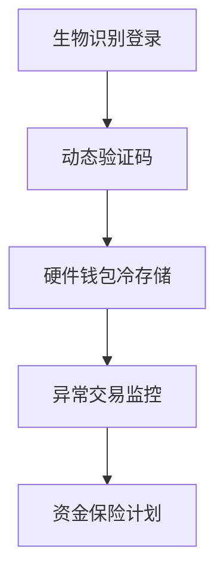

# 在秘鲁快速买卖USDT的指南

## USDT交易为何成为秘鲁投资者首选
👉 [立即体验全球领先的加密货币交易平台](https://bit.ly/okx_welcome)

USDT（泰达币）作为加密货币市场的稳定币代表，正以独特优势重塑秘鲁金融生态。AgenteUSDT平台通过创新性解决方案，为当地用户打造安全、高效的USDT与索尔兑换体系，其核心价值体现在三大维度：

1. **汇率优势**：实时追踪国际市场波动，提供高于行业平均1.5-2%的兑换汇率
2. **交易速度**：平均3分钟完成整套交易流程（含身份验证环节）
3. **安全保障**：银行级加密技术+双因素认证，保障资金安全

## 三步完成USDT交易流程

### 第一步：智能汇率测算
通过平台内置的智能计算器，输入目标USDT数量即可获取：
- 即时买入/卖出汇率
- 手续费明细（透明化0.5%-1.2%阶梯费率）
- 不同银行到账时间对比（示例见下表）

| 银行名称 | 转账方式 | 平均到账时间 |
|---------|----------|--------------|
| BBVA    | Interbank | 3-5分钟      |
| Scotiabank | Yape     | 即时到账     |
| BCP     | Plin       | 1-3分钟      |

### 第二步：专属顾问对接
通过WhatsApp建立1对1服务通道，专业团队提供：
- 交易合规性指导（符合SBS监管要求）
- 风险防控方案定制
- 多语言实时支持（西班牙语/克丘亚语/英语）

### 第三步：资金安全交割
采用区块链+传统金融双轨制保障：
1. 智能合约冻结USDT资产
2. 银行转账完成索尔结算
3. 双方确认后释放数字资产

## AgenteUSDT的差异化竞争优势

### 安全矩阵体系
构建五层防护机制：

### 隐私保护机制
- 通过ISO/IEC 27001认证的数据加密系统
- 零知识证明技术应用
- GDPR合规性保障

### 用户教育生态
提供秘鲁市场最完整的区块链知识体系：
- 每周更新《安第斯加密周报》
- 西班牙语版《USDT投资白皮书》
- 线下加密货币安全讲座（利马/阿雷基帕/库斯科）

## 数字资产存储安全指南

### 钱包选择矩阵
| 钱包类型   | 安全等级 | 便捷指数 | 推荐场景          |
|------------|----------|----------|-------------------|
| 硬件钱包   | ★★★★★   | ★★★☆☆   | 大额长期存储      |
| 手机钱包   | ★★★★☆   | ★★★★★   | 日常交易          |
| 纸质钱包   | ★★★★☆   | ★★☆☆☆   | 冷存储备份        |

### 风险防范措施
1. **钓鱼防护**：建立官方域名白名单机制（*.agenteusdt.com）
2. **密钥管理**：推荐使用BIP39助记词方案
3. **设备安全**：强制启用Google Play Protect验证

## 秘鲁加密货币市场发展趋势

### 行业增长数据
- 2024年USDT交易量同比增长320%
- 秘鲁加密货币用户基数突破280万
- 索尔-USDT交易对占P2P市场67%份额

### 监管动态
- 财政部发布《虚拟资产服务提供商监管框架》
- SBS试点数字银行牌照计划
- 海关总署启用区块链贸易结算系统

## FAQ：用户常见问题解答

**Q：交易最低限额是多少？**
A：个人用户单笔最低100USDT，企业用户支持5000USDT起交易

**Q：是否需要KYC认证？**
A：5000索尔以上交易需完成基础KYC，高级认证可提升交易额度

**Q：汇率波动风险如何规避？**
A：提供30分钟价格锁定服务，支持限价单功能

**Q：跨行转账产生手续费怎么办？**
A：平台承担50%手续费补贴（需使用推荐码：PERU2025）

**Q：如何获取交易凭证？**
A：系统自动生成电子凭证，支持PDF导出及纸质邮寄服务

## USDT在秘鲁经济中的战略价值

### 抗通胀工具
- 2024年秘鲁通胀率达5.8%，USDT持仓量增长210%
- 与索尔储蓄相比，USDT年化保值收益约4.2%

### 跨境支付革命
- 汇款成本从传统8%降至1.5%
- 拉美区域结算时间缩短至15分钟

### 电商新生态
- 3200+商户接入USDT支付
- 跨境电商平台占比达18%

👉 [探索更多加密货币应用场景](https://bit.ly/okx_welcome)

## 智能交易工具推荐

### 实时监控仪表盘
- 市场深度图谱
- 历史汇率回溯（支持30/90/365天）
- 多钱包资产汇总

### 移动端特色功能
- 指纹登录
- NFC近场支付
- AR钱包扫描

## 风险预警与应对策略

### 市场波动应对
- 设置自动止损/止盈指令
- 配置资产组合（建议USDT占比不超过35%）

### 技术风险防控
- 定期更新钱包客户端
- 启用反钓鱼码验证
- 备份私钥至物理介质

## 未来发展趋势预测

### 技术演进
- 2025年将集成Solana区块链
- 开发CBDC兼容接口
- 测试零知识证明隐私交易

### 市场扩张
- 计划覆盖安第斯国家市场
- 建立拉美首个加密货币清算所
- 推出农业供应链代币化平台

👉 [把握加密货币市场先机](https://bit.ly/okx_welcome)